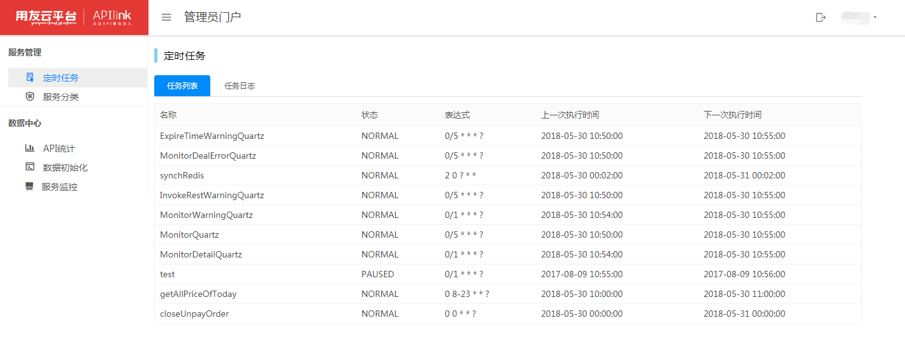
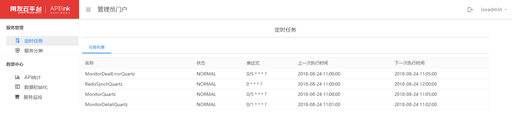
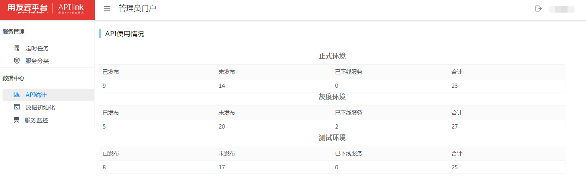
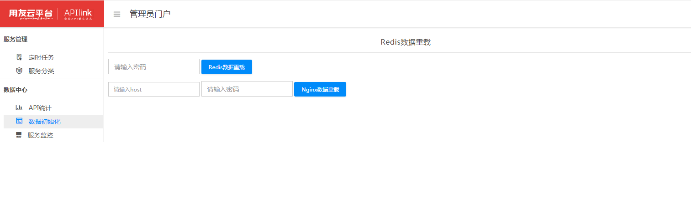
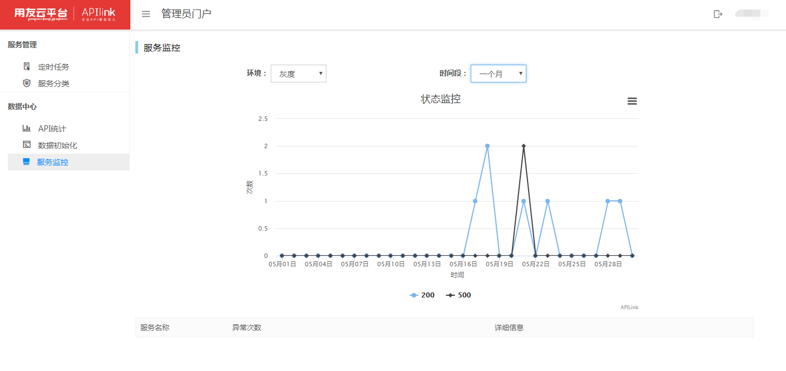

# 管理员门户

管理员门户是API网关内置管理员的门户，API网关有一个管理员账号，可以对服务和数据进行管理。

## 服务管理

服务管是管理员对API网关服务进行的管理。服务管理中包含定时任务和服务分类的管理。

### 定时任务

API网关的内置定时任务有五种。

| 定时任务 | 说明 |
|:-:|:-|
|ExpireTimeWarningQuartz|服务到期预警（服务到期）|
|MonitorDealErrorQuartz|调用错误日志（1分钟执行一次）|
|MonitorDetailQuartz|调用日志详情（30秒执行一次） 注：一天创建一张表|
|MonitorQuartz|调用日志详情（5分钟执行一次）注：一月创建一张表|
|synchRedis|同步使用次数（1分钟执行一次）注：redis同步到数据库中|

### 服务分类

服务分类是API开发者创建新服务时需要选择的服务的类型信息，管理员可以通过服务分类管理对服务分类增加、编辑和删除。

## 数据中心

### API统计

通过管理员门户看到的API统计是API网关所有API开发者发布到正式环境、灰度环境和测试环境的总体统计。

### 数据初始化

数据初始化包含Redis数据重载和Nginx数据重载。API网关会将密码预置后发送给管理员进行统一管理。
Host=host+端口

### 服务监控

服务监控是对三种环境在一定时间内状态的统计。

* 查询值：

环境：正式、灰度、测试

时间段：一小时、一天、一个月、一年
